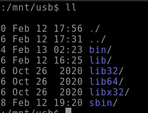

# Analysis - Linux File System :mag_right:

<p align="center">
  
</p>

## Introduction :pencil2:

 #### My system has been compromised, how can I start an analysis?

In this repository we will simulate a file analysis to identify an intrusion on our server. Let's see some tips on files that may have been exploited and some files with log analysis.


## The Compromised Environment

1. In this scenario, our first action after a host is compromised is to remove it from the network to prevent the virus from spreading throughout the network and hosts.

2. In this repository we will focus on analysis, files/logs, however, creating a DUMP of the memory and creating an image of the system before shutting down is very important to not lose data in memory that can be analyzed.

3. All analysis must be done in a VM, isolated from your personal host so as not to cause unplanned damage

For this study, we simulated an infection and will analyze together how to uncover traces left by the invader.
To start the study, we copied some folders with important binaries from the compromised system, and mounted them in ```/mnt/usb/*``` .

Below we have these folders;

<p align="center">
  
  <br>
</p>
<p align="center">
<font color="red">Compromised Host Folders</font>
</p>

