# Analysis - Linux File System Compromised :fire:

<p align="center">
  
</p>

## Introduction :pencil2:

 #### My system has been compromised, How can I start an analysis :question:

In this repository we will simulate a file analysis to identify an intrusion on our server. Let's see some tips on files that may have been exploited and some files with log analysis.


## The Compromised Environment :skull:

1. In this scenario, our first action after a host is compromised is to remove it from the network to prevent the virus from spreading throughout the network and hosts.

2. In this repository we will focus on analysis, files/logs, however, creating a DUMP of the memory and creating an image of the system before shutting down is very important to not lose data in memory that can be analyzed.

3. All analysis must be done in a VM, isolated from your personal host so as not to cause unplanned damage.

4. The compromised environment was running a **Web Server**. Maybe it's a way to start.

For this study, we simulated an infection and will analyze together how to uncover traces left by the invader.

<p align="center">
  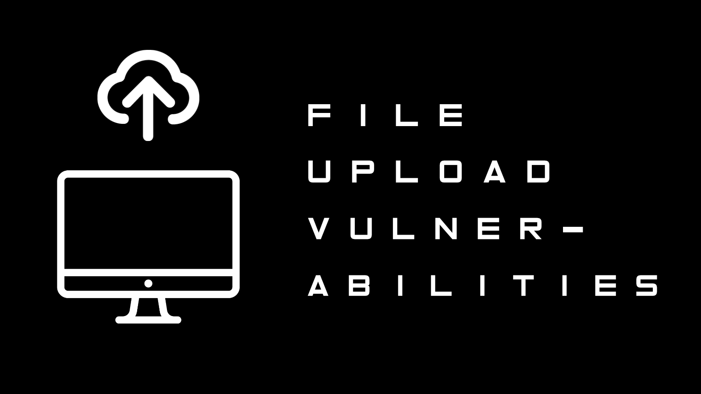
</p>


## Analyzing the Web Server :globe_with_meridians:

* The compromised server is exposed to the internet by **Apache2**. Let's start with him. The default folder used by Apache is `/var/www/html`.

<p align="center">
  
  <br>
</p>

* From the files, we can deduce that it is a file upload system, possibly stored in the `/uploads` folder. Listing the `/uploads` folder, we can see something different, an unusual extension (**.phtml**) was sent to the server.

<p align="center">
  
  <br>
</p>

> [!NOTE]
The **.phtml** file extension is usually associated with PHP script files that contain embedded HTML code. Is used to create dynamic web pages that combine PHP code with HTML markup.

* Analyzing the file, we can see a malicious web shell. The <span style="color:red;">**SYSTEM**</span> command in PHP executes commands directly on the OS, received via the GET parameter called 'cmd'.

<p align="center">
  
  <br>
</p>

## Looking at more files :page_with_curl:

* We can consider that the OS exploitation happened via a malicious webshell via upload. When compromising the web server, by default, it runs with the user **WWW-DATA**, knowing this, we can look for more files with this owner, imagining that the attacker creates persistence on the host.

> [!NOTE]
The **Persistence** phase is commonly carried out after the host is compromised, being an easy way for the attacker to return to the target without problems.

* Attackers often target directories with write permissions to upload malicious files. Common writable directories include:

    * **/tmp**: The temporary directory is writable by all users, making it a common choice.
    * **/var/tmp**: Another temporary directory commonly with world write permissions.
    * **/dev/shm**: The shared memory file system, which is also normally writable by all users.


<p align="center">
  
</p>

* The command `find / -user www-data -type f 2>/dev/null` searches for all files where the owner is www-data. In this case, we can observe a suspicious <span style="color:red;">**reverse.elf**</span> file, possibly created for persistence.

Before we investigate the reverse.elf file further, there are several other useful find commands that can be used to pull particular files during an investigation:

| Command       |   explanation     |
|------------|------------|
| `find / -group GROUPNAME 2>/dev/null`|Retrieve a list of files and directories owned by a specific group.   |
| `find / -perm -o+w 2>/dev/null`      |Retrieve a list of all world-writable files and directories.  |
| `find / -type f -cmin -5 2>/dev/null`|Retrieve a list of files created or changed within the last five minutes. |

## Property of a Binary :mag_right:

### Metadata

* A file's metadata shows information about the binary's manipulation, file size, timestamps and, in some cases, author details of specific files.

    ### ExifTool

  * To analyze the metadata of a file, we can use the tool called **ExifTool** (https://exiftool.org). Let's use this in our suspect binary in elf.

<p align="center">
  
  <span style="color:red">Binary Features</span>
</p>

### Analysing Checksums

* The checksum of a file is a kind of unique digital "fingerprint" generated by a specific mathematical algorithm such as MD5, SHA1, SHA256, and others. Its primary purpose is to verify the integrity and authenticity of data within a file. 
* Below we have an example of using MD5 and SHA256 in a word (avocado), with small text differences;

<p align="center">
  
</p>

* Let's find out the **MD5** and **SHA1** checksum of our suspect binary.

<p align="center">
  
</p>

* With the checksum generated, we can use it to search for more information on malware analysis sites. A well-known one called [VirusTotal](https://www.virustotal.com.com/hex-to-text.php.). 
* We can see that this is a common malware, widely identified by popular AV's. We can also see a reference to the **Metasploit Framework**, probably the easily accessible tool for creating the malware.


<p align="center">
  
  <span style="color:red">VirusTotal</span>
</p>


## Users and Groups Linux

* Continuing our investigation, a good tip for identifying persistence and lateral movements are the users and groups of users in the system. Let's dig into our system.

### User Accounts

* In a UNIX system, it is common to identify all users of the system through the `/etc/passwd` file. In addition to users, we were able to identify the attributes, ID (UID), group ID (GID), home directory location, and the login shell defined for the user. Let's look at this file on our system.

<p align="center">
  
</p>

> [!NOTE]
We can see an unusual user created with ID 0, called **b4ckd00r3d**.

* Attackers can maintain access to a system by creating a backdoor user with root permissions. We can leverage the cut and grep commands to identify this type of user account backdoor quickly. 

```
cat /etc/passwd | cut -d: -f1,3 | grep ':0$'
```
<p align="center">
  
</p>


* The ID 0 is reserved exclusively for the superuser in the Linux operating system and is fundamentally different from all other user accounts. In our system, we can see that a user with superuser (root) privileges has been created.

### Groups

* In Linux systems, certain groups grant specific privileges that attackers may target to escalate their privileges. Some important Linux groups that might be of interest to an attacker include:

  * **sudo or wheel**: Members of the sudo (or wheel) group have the authority to execute commands with elevated privileges using sudo.
  * **adm**: The adm group typically has read access to system log files.
  * **shadow**: The shadow group is related to managing user authentication and password information. With this membership, a user can read the /etc/shadow file, which contains the password hashes of all users on the system.
  * **disk**: Members of the disk group have almost unrestricted read and limited write access inside the system.

  * Just like the file `/etc/passwd` shows users, in the UNIX system there is a file to show groups in `/etc/group`.

<p align="center">
  
</p>

* Below we have some basic commands for using group me in our system.

```
groups (user) - Show the groups that each user
getent group (group name) - To list all members of a group
getent group (group id) - Tist users by group id
```

## Login and Logs

* In the UNIX system there are several ways to monitor and identify possible suspicious activities in the environment. In this step, we will analyze some access log files.

### Last and Lastb

* The last command is an excellent tool for examining user logins and sessions. It is used to display the history of the last logged-in users. It works by reading the /var/log/wtmp file, which is a file that contains every login and logout activity on the system. Similarly, lastb specifically tracks failed login attempts by reading the contents of /var/log/btmp, which can help identify login and password attacks.

<p align="center">
  
</p>

* Similar to lastb, we can view unsuccessful logins in the file `/var/log/auth.log` or `/var/log/secure` on some distributions like CentOS or Red Hat.

<p align="center">
  
</p>

### Who

* The who command can be used to display the users that are currently logged into the system. The output of this command can provide details such as the name of the user logged in, the terminal device used, the time that the session was established, idle activity, the process ID of the shell, and additional comments that may include details such as the initial command used to start the session.

<p align="center">
  
</p>

### Sudo

* Like the other user and group files, sudo is located in `/etc/sudoers`, where it is defined who can execute commands as another user. Normally, users registered in this file allow executing commands as root.

<p align="center">
  
</p>

* The sudoers file requires root (or sudo) access to view.

## Sensitive Directories and Files

To continue our investigation of the system's users and groups, we must also examine each user's home directory, files, history, and custom settings.

### Home Directories

* The `/home` repository is normally where each user's folder on the system is located. In it we can find personalized settings for each one. This is not always the directory, looking in the `/etc/passwd` file, we can see each location of each user's home folder. On our host we have the folders below.

<p align="center">
  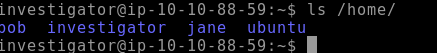
</p>

### Hidden Files

* A way to hide files on the system, hiding folders/files. Additionally, sensitive system settings are typically stored. To display hidden files, we can list them with `ls -a`. We can see the hidden files/folders when they start with `.`.

  * **.bash_history**: This file contains a user's command history and can be used to show previous commands executed by the user.
  * **.bashrc** and **.profile**: These are configuration files used to customise a user's Bash shell sessions and login environment, respectively.

<p align="center">
  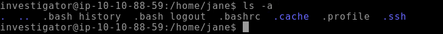
</p>

### SSH Key

* The hidden `.ssh` folder is responsible for storing the public/private key for the SSH connection to the system. Stealing the private key can allow the attacker to reconnect to the host without any difficulty.
* If a malicious user gains unauthorised access to a system and wants to persistently access another user's account by adding their public key to the `authorized_keys` file.

<p align="center">
  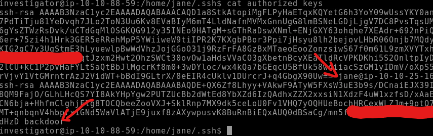
</p>

> [!NOTE]
In this case, we can see something suspicious, where within the ssh config of the user Jane, there is another public key with an unknown user, **backdoor**.

## Binary Analysis and Bypass Permissions :warning:

* Another area to look at within our compromised host's file system is identifying binaries and executables that the attacker may have created, altered, or exploited through permission misconfigurations.*

### Find

* With the command below, we can search for all operating system binaries, starting at the root `/` and searching recursively in all folders.

```
find / -type f -executable 2>/dev/null
```

* This command will show thousands of binaries, and you may need to use some more filters. 

<p align="center">
  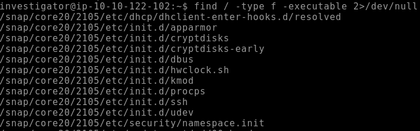
</p>

### Strings

* The string function is useful for identifying possible functions, texts, variables or any other information that can be returned by human-readable text from a binary. In this example I will use any banario used by the previous command, `find /`.

<p align="center">
  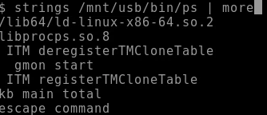
</p>
 
 * In this analysis, we were able to find strings, probably of options for this binary.

<p align="center">
  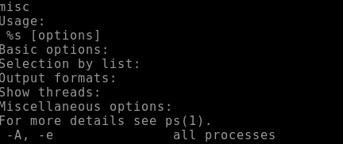
</p>


### Debsums

*  Debsums is a command-line utility for Debian-based Linux systems that verifies the integrity of installed package files. debsums automatically compares the MD5 checksums of files installed from Debian packages against the known checksums stored in the package's metadata. If any files have been modified or corrupted, debsums will report them, citing potential issues with the package's integrity.

* The command that we can use to check the integrity of system files is below. This command needs to be run as sudo/root on the system

```
sudo debsums -e -s
```
<p align="center">
  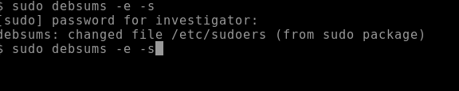
</p>

> [!NOTE]
In our system, a change in **/etc/sudoers** was identified. As we saw previously, this file is responsible for giving the privileges of running as root to other users.

### Binary Permissions

* SetUID (SUID) and SetGID (SGID) are special permission bits in Unix operating systems. These permission bits change the behaviour of executable files, allowing them to run with the privileges of the file owner or group rather than the privileges of the user who executes the file. If a binary or executable on the system is misconfigured with an SUID or SGID permission set, an attacker may abuse the binary to break out of a restricted (unprivileged) shell through legitimate but unintended use of that binary.

* To search for these binaries with special permissions, we can use the command below;

```
find / -perm -u=s -type f 2>/dev/null
```

<p align="center">
  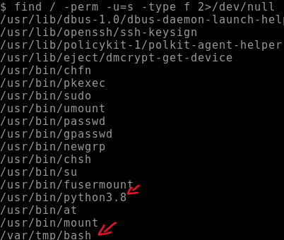
</p>

* Much of the output here is expected as these binaries require the SUID bit and are not vulnerable. However, two of these results stand out. Firstly, Python should never be given SUID permission, as it is trivial to escalate privileges to the owner. Additionally, any SUID binaries in the `/tmp` or `/var/tmp` directory stand out as these directories are typically writable by all users, and unauthorised creation of SUID binaries in these directories poses a notable risk.

### Analyzing :shipit:

* We have a suspicion that the attacker could be doing something with Python. Remember the **.bash_history** file? It keeps history of command execution. Let's search each user's `/home/` and check if there was a Python command.

* Analyzing Jane's home folder.
<p align="center">
  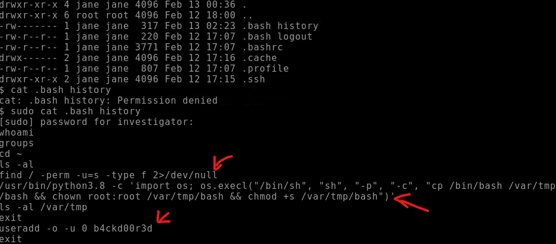
</p>

* We can see some suspicious commands, let's analyze.
* As we already know, this command searches for SUID with special access.
```
find / -perm -u=s -type f 2>/dev/null
```

* It was used with python binary, which we found previously. The attacker was able to create a copy of the `/bin/bash` and place it into the `/var/tmp` folder. Additionally, the attacker changed the owner of this file to root and added the SUID permission to it (chmod +s).

```
/usr/bin/python3.8 -c 'import os; os.execl("/bin/sh", "sh", "-p", "-c", "cp /bin/bash /var/tmp
/bash && chown root:root /var/tmp/bash && chmod +s /var/tmp/bash")'
```
* After making an SUID copy of /bin/bash, the attacker elevated to root by running `/var/tmp/bash -p`.

## Final Considerations

* In this repository we carry out a basic analysis to identify important points that may have been used by an attacker to compromise our environment. We also saw some folders that can be used to persist the attack. There are already created tools that can automate the analysis process, such as **Chkrootkit** or **RKHunter**.

**Chkrootkit**

* Chkrootkit is a popular Unix-based utility used to examine the filesystem for rootkits. It operates as a simple shell script, leveraging common Linux binaries like grep and strings to scan the core system programs to identify signatures. It can use the signatures from files, directories, and processes to compare the data and identify common patterns of known rootkits.

* Using Chkrootkit on our system, findme.sh was identified as suspicious.

<p align="center">
  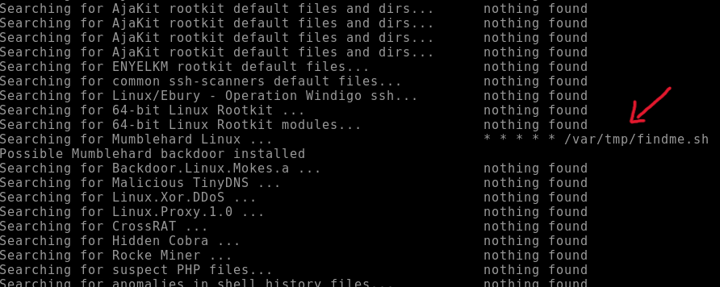
</p>

* You can test in: [chkrootkit](https://www.chkrootkit.org/)


**RKHunter**

* RKHunter is another helpful tool designed to detect and remove rootkits on Unix-like operating systems. It offers a more comprehensive and feature-rich rootkit detection check compared to chkrootkit. RKHunter can compare SHA-1 hashes of core system files with known good ones in its database to search for common rootkit locations, wrong permissions, hidden files, and suspicious strings in kernel modules. It is an excellent choice for a more comprehensive assessment of the affected system.

* The **RKhunter** will generate a list of binaries that can be categorized as suspicious. Some that we can show are users with UID 0 and changes to passwd and groups

<p align="center">
  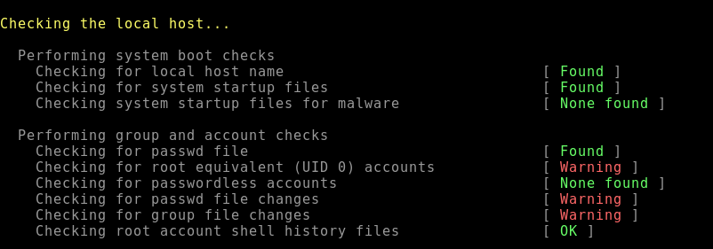
</p>

* You can test in: [rkhunter](https://rkhunter.sourceforge.net/)
 ---
<p align="center">
  
</p>

<p align="center">
I hope this analysis is useful in some way. See you next time.
</p>