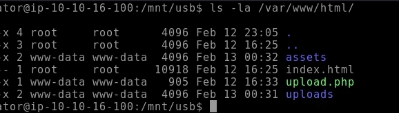
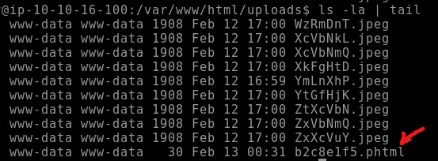
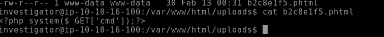
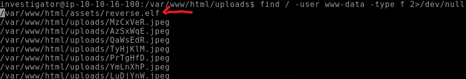

# Analysis - Linux File System :mag_right:

<p align="center">
  
</p>

## Introduction :pencil2:

 #### My system has been compromised, how can I start an analysis:question:

In this repository we will simulate a file analysis to identify an intrusion on our server. Let's see some tips on files that may have been exploited and some files with log analysis.


## The Compromised Environment :skull:

1. In this scenario, our first action after a host is compromised is to remove it from the network to prevent the virus from spreading throughout the network and hosts.

2. In this repository we will focus on analysis, files/logs, however, creating a DUMP of the memory and creating an image of the system before shutting down is very important to not lose data in memory that can be analyzed.

3. All analysis must be done in a VM, isolated from your personal host so as not to cause unplanned damage.

4. The compromised environment was running a **Web Server**. Maybe it's a way to start.


For this study, we simulated an infection and will analyze together how to uncover traces left by the invader.
To start the study, we copied some folders with important binaries from the compromised system, and mounted them in ```/mnt/usb/*``` .

Below we have these folders;

<p align="center">
  
  <br>
  <span style="color:red">Backup of folders for analysis.</span>
</p>

## Analyzing the Web Server :globe_with_meridians:

* The compromised server is exposed to the internet by **Apache2**. Let's start with him. The default folder used by Apache is `/var/www/html`

<p align="center">
  
  <br>
</p>

* From the files, we can deduce that it is a file upload system, possibly stored in the `/uploads` folder. Listing the `/uploads` folder, we can see something different, an unusual extension (**.phtml**) was sent to the server.

<p align="center">
  
  <br>
</p>

> [!NOTE]
The **.phtml** file extension is usually associated with PHP script files that contain embedded HTML code. Is used to create dynamic web pages that combine PHP code with HTML markup.

* Analyzing the file, we can see a malicious web shell. The <span style="color:red;">**SYSTEM**</span> command in PHP executes commands directly on the OS, received via the GET parameter called 'cmd'.

<p align="center">
  
  <br>
</p>

## Looking at more files :page_with_curl:

* We can consider that the OS exploitation happened via a malicious webshell via upload. When compromising the web server, by default, it runs with the user **WWW-DATA**, knowing this, we can look for more files with this owner, imagining that the attacker creates persistence on the host.

> [!NOTE]
The **Persistence** phase is commonly carried out after the host is compromised, being an easy way for the attacker to return to the target without problems.

* Attackers often target directories with write permissions to upload malicious files. Common writable directories include:

    * **/tmp**: The temporary directory is writable by all users, making it a common choice.
    * **/var/tmp**: Another temporary directory commonly with world write permissions.
    * **/dev/shm**: The shared memory file system, which is also normally writable by all users.


<p align="center">
  
  <br>
</p>

* The command `find / -user www-data -type f 2>/dev/null` searches for all files where the owner is www-data. In this case, we can observe a suspicious <span style="color:red;">**reverse.elf**</span> file, possibly created for persistence.

Before we investigate the reverse.elf file further, there are several other useful find commands that can be used to pull particular files during an investigation:

| Command       |   explanation     |
|------------|------------|
| `find / -group GROUPNAME 2>/dev/null`|Retrieve a list of files and directories owned by a specific group.   |
| `find / -perm -o+w 2>/dev/null`      |Retrieve a list of all world-writable files and directories.  |
| `find / -type f -cmin -5 2>/dev/null`|Retrieve a list of files created or changed within the last five minutes. |

## Binary Analysis :mag_right:

Working...
