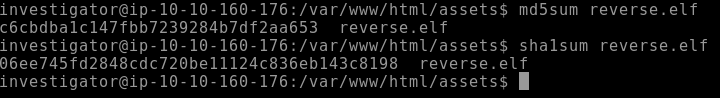

# Analysis - Linux File System Compromised :fire:

<p align="center">
  
</p>

## Introduction :pencil2:

 #### My system has been compromised, How can I start an analysis :question:

In this repository we will simulate a file analysis to identify an intrusion on our server. Let's see some tips on files that may have been exploited and some files with log analysis.


## The Compromised Environment :skull:

1. In this scenario, our first action after a host is compromised is to remove it from the network to prevent the virus from spreading throughout the network and hosts.

2. In this repository we will focus on analysis, files/logs, however, creating a DUMP of the memory and creating an image of the system before shutting down is very important to not lose data in memory that can be analyzed.

3. All analysis must be done in a VM, isolated from your personal host so as not to cause unplanned damage.

4. The compromised environment was running a **Web Server**. Maybe it's a way to start.

For this study, we simulated an infection and will analyze together how to uncover traces left by the invader.
To start the study, we copied some folders with important binaries from the compromised system, and mounted them in ```/mnt/usb/*``` .

Below we have these folders;

<p align="center">
  
  <br>
  <span style="color:red">Backup of folders for analysis.</span>
</p>

## Analyzing the Web Server :globe_with_meridians:

* The compromised server is exposed to the internet by **Apache2**. Let's start with him. The default folder used by Apache is `/var/www/html`.

<p align="center">
  
  <br>
</p>

* From the files, we can deduce that it is a file upload system, possibly stored in the `/uploads` folder. Listing the `/uploads` folder, we can see something different, an unusual extension (**.phtml**) was sent to the server.

<p align="center">
  
  <br>
</p>

> [!NOTE]
The **.phtml** file extension is usually associated with PHP script files that contain embedded HTML code. Is used to create dynamic web pages that combine PHP code with HTML markup.

* Analyzing the file, we can see a malicious web shell. The <span style="color:red;">**SYSTEM**</span> command in PHP executes commands directly on the OS, received via the GET parameter called 'cmd'.

<p align="center">
  
  <br>
</p>

## Looking at more files :page_with_curl:

* We can consider that the OS exploitation happened via a malicious webshell via upload. When compromising the web server, by default, it runs with the user **WWW-DATA**, knowing this, we can look for more files with this owner, imagining that the attacker creates persistence on the host.

> [!NOTE]
The **Persistence** phase is commonly carried out after the host is compromised, being an easy way for the attacker to return to the target without problems.

* Attackers often target directories with write permissions to upload malicious files. Common writable directories include:

    * **/tmp**: The temporary directory is writable by all users, making it a common choice.
    * **/var/tmp**: Another temporary directory commonly with world write permissions.
    * **/dev/shm**: The shared memory file system, which is also normally writable by all users.


<p align="center">
  
</p>

* The command `find / -user www-data -type f 2>/dev/null` searches for all files where the owner is www-data. In this case, we can observe a suspicious <span style="color:red;">**reverse.elf**</span> file, possibly created for persistence.

Before we investigate the reverse.elf file further, there are several other useful find commands that can be used to pull particular files during an investigation:

| Command       |   explanation     |
|------------|------------|
| `find / -group GROUPNAME 2>/dev/null`|Retrieve a list of files and directories owned by a specific group.   |
| `find / -perm -o+w 2>/dev/null`      |Retrieve a list of all world-writable files and directories.  |
| `find / -type f -cmin -5 2>/dev/null`|Retrieve a list of files created or changed within the last five minutes. |

## Binary Analysis :mag_right:

### Metadata

* A file's metadata shows information about the binary's manipulation, file size, timestamps and, in some cases, author details of specific files.

    ### ExifTool

  * To analyze the metadata of a file, we can use the tool called **ExifTool** (https://exiftool.org). Let's use this in our suspect binary in elf.

<p align="center">
  
  <span style="color:red">Binary Features</span>
</p>

### Analysing Checksums

* The checksum of a file is a kind of unique digital "fingerprint" generated by a specific mathematical algorithm such as MD5, SHA1, SHA256, and others. Its primary purpose is to verify the integrity and authenticity of data within a file. 
* Below we have an example of using MD5 and SHA256 in a word (avocado), with small text differences;

<p align="center">
  
</p>

* Let's find out the **MD5** and **SHA1** checksum of our suspect binary.

<p align="center">
  
</p>

* With the checksum generated, we can use it to search for more information on malware analysis sites. A well-known one called [VirusTotal](https://www.virustotal.com.com/hex-to-text.php.). 
* We can see that this is a common malware, widely identified by popular AV's. We can also see a reference to the **Metasploit Framework**, probably the easily accessible tool for creating the malware.


<p align="center">
  
  <span style="color:red">VirusTotal</span>
</p>


## Users and Groups Linux

* Continuing our investigation, a good tip for identifying persistence and lateral movements are the users and groups of users in the system. Let's dig into our system.

### User Accounts

* In a UNIX system, it is common to identify all users of the system through the `/etc/passwd` file. In addition to users, we were able to identify the attributes, ID (UID), group ID (GID), home directory location, and the login shell defined for the user. Let's look at this file on our system.

<p align="center">
  
</p>

> [!NOTE]
We can see an unusual user created with ID 0, called **b4ckd00r3d**.

* Attackers can maintain access to a system by creating a backdoor user with root permissions. We can leverage the cut and grep commands to identify this type of user account backdoor quickly. 

```
cat /etc/passwd | cut -d: -f1,3 | grep ':0$'
```
<p align="center">
  
</p>


* The ID 0 is reserved exclusively for the superuser in the Linux operating system and is fundamentally different from all other user accounts. In our system, we can see that a user with superuser (root) privileges has been created.

### Groups

* In Linux systems, certain groups grant specific privileges that attackers may target to escalate their privileges. Some important Linux groups that might be of interest to an attacker include:

  * **sudo or wheel**: Members of the sudo (or wheel) group have the authority to execute commands with elevated privileges using sudo.
  * **adm**: The adm group typically has read access to system log files.
  * **shadow**: The shadow group is related to managing user authentication and password information. With this membership, a user can read the /etc/shadow file, which contains the password hashes of all users on the system.
  * **disk**: Members of the disk group have almost unrestricted read and limited write access inside the system.

  * Just like the file `/etc/passwd` shows users, in the UNIX system there is a file to show groups in `/etc/group`.

<p align="center">
  
</p>

* Below we have some basic commands for using group me in our system.

```
groups (user) - Show the groups that each user
getent group (group name) - To list all members of a group
getent group (group id) - Tist users by group id
```

## Login and Logs

* In the UNIX system there are several ways to monitor and identify possible suspicious activities in the environment. In this step, we will analyze some access log files.

### Last and Lastb

* The last command is an excellent tool for examining user logins and sessions. It is used to display the history of the last logged-in users. It works by reading the /var/log/wtmp file, which is a file that contains every login and logout activity on the system. Similarly, lastb specifically tracks failed login attempts by reading the contents of /var/log/btmp, which can help identify login and password attacks.

<p align="center">
  
</p>

* Similar to lastb, we can view unsuccessful logins in the file `/var/log/auth.log` or `/var/log/secure` on some distributions like CentOS or Red Hat.

<p align="center">
  
</p>

### Who

* The who command can be used to display the users that are currently logged into the system. The output of this command can provide details such as the name of the user logged in, the terminal device used, the time that the session was established, idle activity, the process ID of the shell, and additional comments that may include details such as the initial command used to start the session.

<p align="center">
  
</p>

### Sudo

* Like the other user and group files, sudo is located in `/etc/sudoers`, where it is defined who can execute commands as another user. Normally, users registered in this file allow executing commands as root.

<p align="center">
  
</p>

* The sudoers file requires root (or sudo) access to view.

## Sensitive directories and Files

Working...